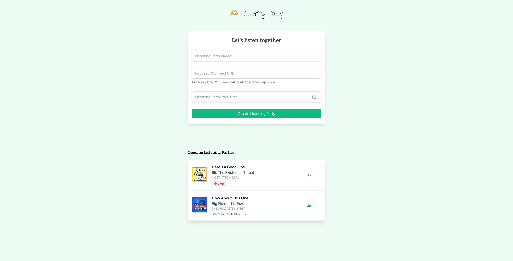

# Listening Party

## Description

This full-stack application lets you create listening parties—spaces where users can enjoy a podcast together, share emoji reactions, and chat in real-time.

The feature-rich homepage shows ongoing parties with their status and start times, and allows easy party creation. When setting up a party, you can pick the date and time using a simple WireUI date picker. After creating the party, you’ll enter a waiting room with a countdown to the start time.

The real-time chat with emoji reactions is the highlight, letting you comment and express yourself while listening. You need to be logged in to comment, but guests can react with emojis freely.

Once the podcast ends, a card will notify you of the session's conclusion.

Built on the TALL stack (Tailwind, AlpineJS, Laravel, Livewire) and WireUI components.



## Stack

-   [Tailwind](https://tailwindcss.com) - Tailwind CSS is a framework that lets you build any design, directly in your HTML, with classes like flex, pt-4, text-center and rotate-90. It is easy to customize, scalable, and has a large community of adopters and creators who love its speed, flexibility and design-first approach.
-   [Alpine](https://alpinejs.dev) - Alpine.js is a collection of attributes, properties, and methods that let you add behavior to your markup. Learn how to use Alpine to create components, sync data, handle events, and more.
-   [Laravel](https://laravel.com/) - Laravel is a web application framework with expressive, elegant syntax. We believe development must be an enjoyable and creative experience to be truly fulfilling. Laravel attempts to take the pain out of development by easing common tasks used in most web projects.
-   [Livewire](https://laravel-livewire.com) - Say hello to Livewire. Hi Livewire! Livewire is a full-stack framework for Laravel that makes building dynamic interfaces simple, without leaving the comfort of Laravel. Consider my interest piqued. It's not like anything you've seen before. The best way to understand it is to just look at the code.
-   [Reverb](https://reverb.laravel.com) - Reverb is an open source and first-party WebSocket server for Laravel, allowing real-time communication between client and server. It supports Pusher protocol, Laravel broadcasting, Laravel Echo, and horizontal scaling with Redis.
-   [WireUI](https://wireui.dev) - WireUI is a library of components for Alpine.js, Tailwind, Livewire, and the Tall Stack. It offers lightning-fast development, high customizability, and seamless integration with various technologies.

## Project structure

```
PROJECT_ROOT
├── app
│   ├── Events                # Real-time events for reactions and messages
│   ├── Http
│   │   └── Middleware        # Custom middleware
│   ├── Jobs                  # Background job processing
│   └── Models                # Eloquent database models
├── config
│   └── wireui.php            # WireUI-specific configurations
├── database
│   └── migrations            # Project-specific database migrations
├── resources
│   ├── css                   # Custom styles
│   ├── js
│   │   └── alpine            # Custom AlpineJS scripts for listening parties
│   └── views
│       ├── components        # Reusable Blade components
│       ├── livewire          # Livewire components for pages
│       └── home.blade.php    # Homepage template
├── routes
│   ├── channels.php          # Broadcast channel authentication logic
│   ├── console.php           # Schedule definitions for tasks
│   └── web.php               # Web routes for application
└── tailwind.config.js        # Tailwind CSS configuration
```
